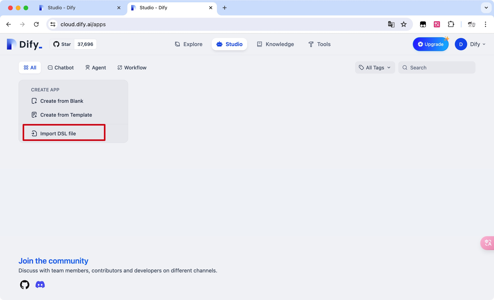
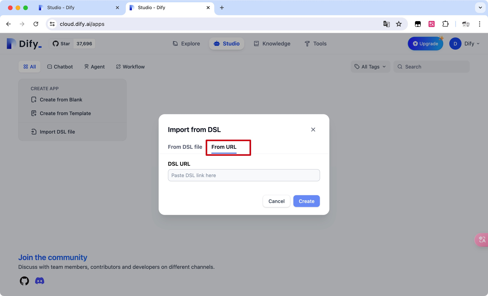

# Awesome-Dify-Workflow

  
  

Sharing some beneficial Dify workflows that are ideal for both personal use and educational purposes. Please import these workflows using Dify 0.6.14 or later versions.

All of these workflows are free to use and do not require integration with third-party platform APIs. The model utilized is Deepseek, primarily due to its cost-effectiveness, offering a 5 million Token bonus upon registration.

More workflows are currently being collected and organized...

## Snapshots
All DSLs are designed as workflow patterns, which can be readily published as tools and subsequently integrated into the ChatBot process. These workflows encompass fundamental elements such as inputs, conditional evaluations, variable aggregators, and outputs.

# DSL Directory

Refer to the descriptions of each yml file below to locate the Workflow you need. Once identified, find the corresponding file in the DSL folder, copy its URL, and import it into your Dify account.

## Translation
- **中译英.yml** Utilizes Baoyu's Prompt methodology, involving direct translation, reflection, and retranslation, to convert Chinese into high-quality English.

- **DuckDuckGo 翻译+LLM 二次翻译.yml** Emulates the three-step translation process but substitutes the initial direct translation with a traditional engine, thereby conserving Tokens, boosting efficiency, and improving translation quality.

- **translation_workflow.yml** A translation tool developed based on Andrew Ng's Agentic Workflow, requiring input of four parameters: `input language`, `target language`, `country`, and `original text`, offering more nuanced translation outcomes, meticulously crafted following the original prompts of [translation-agent](https://github.com/andrewyng/translation-agent), with no alterations made.

## Tools
- **SEO Slug Generator.yml** Creates URL slugs for your blog posts, inspired by Baoyu's Twitter.

# Usage
Register for a [Dify](https://cloud.dify.ai/) account and add the Deepseek model.

Copy the URL of the Workflow and import the DLS file to publish your own Workflow, which you can then use. Of course, you can make necessary adjustments, such as adjusting the template or modifying the prompts.

